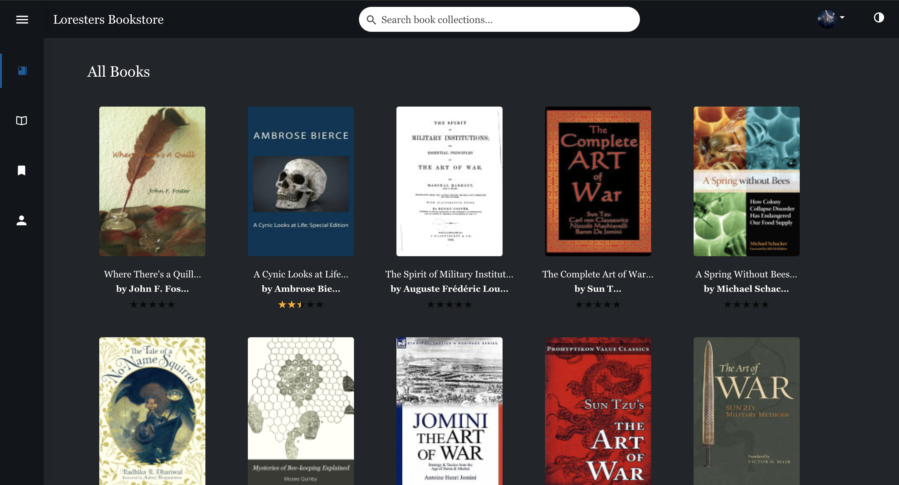
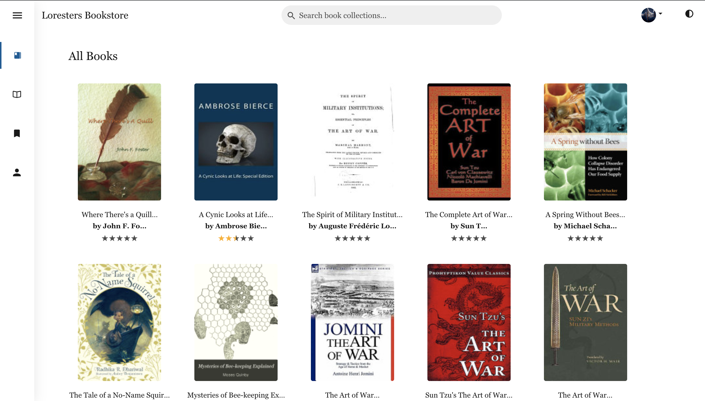

<h1 align="center">The Knowledge Store</h1>
<p align="center">
The knowledge store is a book archive project leveraging the Google Books API to introduce you to thousands of books. On this platform, you can search and filter books using full text search, bookmark books, make your book visible, leave reviews etc.
</p>
<p align="center">
There is also support for theme switching betwen light and dark mode.
</p>

<p align="center">
  
  &nbsp;
  &nbsp;
  &nbsp;
  &nbsp;
  &nbsp;
  
</p>

---

# Table of Contents
* [Demo](https://github.com/Nedson202/Knowledge-store-front#demo)
* [Features](https://github.com/Nedson202/Knowledge-store-front#features)
* [Technologies](https://github.com/Nedson202/Knowledge-store-front#technologies)
* [Installation Setup](https://github.com/Nedson202/Knowledge-store-front#installation-setup)
* [Testing](https://github.com/Nedson202/Knowledge-store-front#testing)
* [Language](https://github.com/Nedson202/Knowledge-store-front#language)
* [Coding style](https://github.com/Nedson202/Knowledge-store-front#style-guide)
* [Dependencies](https://github.com/Nedson202/Knowledge-store-front#dependencies)
* [License](https://github.com/Nedson202/Knowledge-store-front#license)

## Demo
Here is a working live demo: https://lorester-bookstore.netlify.com

The server project is located at https://github.com/Nedson202/Knowledge-store-back

## Features
* Login
* Sign up
* View book catalog and book profiles
* Add and remove reviews and replies
* Like reviews
* Add books
* Mark books as favorites
* Remove book and multiple books from favorites
* View your books and those marked as favorites
* Update profile information
* Reset password
* Upload profile image
* PWA support
* Full-text search support for fields like book title, publication year, authors, genre, etc.

## Technologies
* React
* Redux
* Apollo-client
* Ant Design - A design system with values of Nature and Determinacy for better user experience of enterprise applications. https://ant.design

## Installation Setup

* **Clone repo:**

  Open **CMD(command prompt)** for windows users, or any other terminal you use.

  ```
    git clone https://github.com/Nedson202/Knowledge-store-front
  ```

* **Install project dependencies:**

  This codebase uses the yarn package manager.

  Enter the following on your Terminal/CMD to change into the directory of the cloned repo and install all app dependencies

  ```
    Install the yarn package manager if you don't have it(optional).

    $ npm i -g yarn


    Change directory to cloned repo (Knowledge-store-front)

    $ cd Knowledge-store-front

    Install all dependencies

    $ yarn
  ```


* **Start the app:** Enter the following on your terminal/cmd to start the app

  ```
    $ yarn start
  ```

* **Open browser**

  ```
    Navigate to http://localhost:3000 on the browser
  ```

* **Additional setup:** This app uses the dotenv package to load environment variables. For more info visit [dotenv](https://www.npmjs.com/package/dotenv).

  * Create a .env file in the root directory of the codebase
  * Copy the content of the .env-sample file and add their corresponding values appropriately.

## Testing
React-testing-library and Jest powers the tests written on this codebase.

```
  Run tests without watching for new changes to test with:

  $ yarn test

  Watch for changes with:

  $ yarn: test:jest:watch
```

## Language
* Javascript

## Style Guide
* Airbnb style guide

## Dependencies
> Click [here](https://github.com/Nedson202/Knowledge-store-front/blob/develop/package.json) to view all dependencies.

## License

> You can check out the full license [here](https://github.com/Nedson202/Knowledge-store-front/blob/develop/LICENSE)

This project is licensed under the terms of the MIT license.

